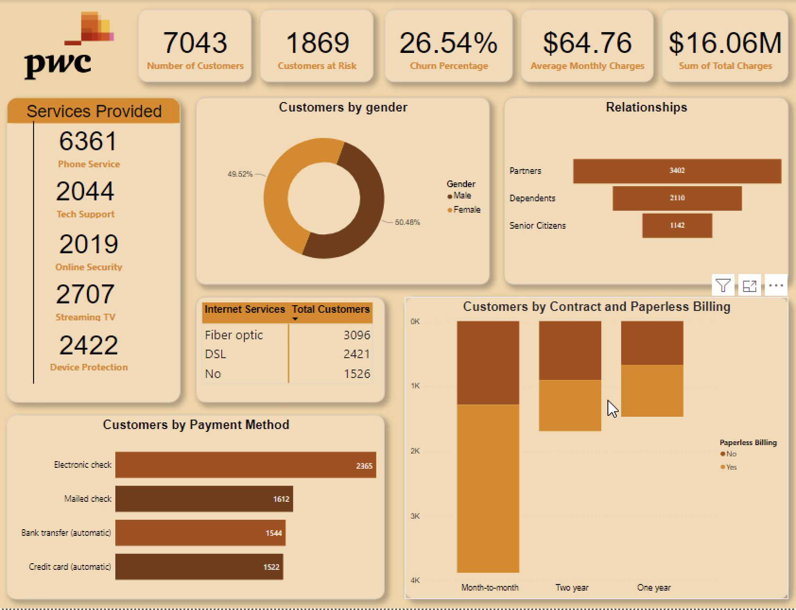

# PwC-Customer-Churn-Analysis
## Introduction
This is a project that entails developing an advanced customer dashboard using Power BI to improve customer retention and reduce churn in the Telecommunication Sector

## Key Performance Indicators (KPIs)
1. Number of Customers: There are 7048 customers that use this platform.
2. Customers at Risk: About *26.5% of the clients are at Risk* and that is about 1869 of the Customer Population.
3. Total Charges: The sum of the total charges is $16.06M.
4. Average Monthly Charges: The average monthly charges are $64.76.
5. Services Provided: There are various Services provided but the most important ones are the Phone services, Tech support, Online security, Streaming TV and Device protection.

These Key Performance Indicators (KPIs) provides actionable insights which enable stakeholders to make informed decisions and take actions based on their customers needs and concerns.

## Report

