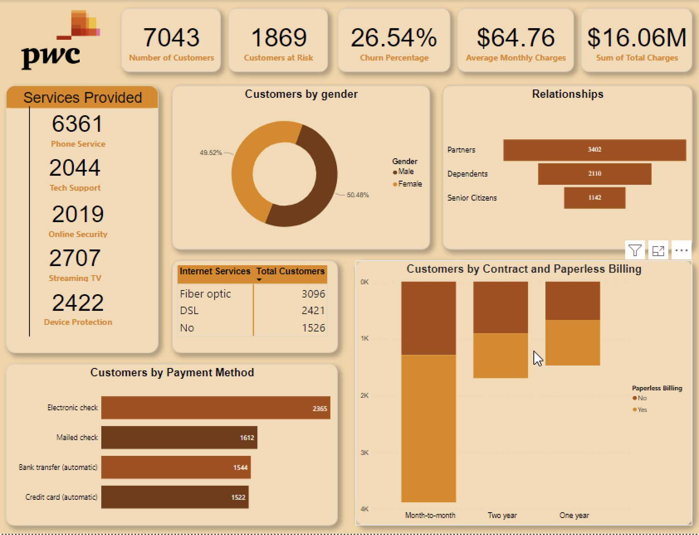

# PwC-Customer-Churn-Analysis
## Introduction
This is a project that entails developing an advanced customer dashboard using Power BI to improve customer retention and reduce churn in the Telecommunication Sector

## Key Performance Indicators (KPIs)
1. Number of Customers: 7048 customers use this platform.
2. Customers at Risk: About *26.5% of the clients are at Risk*, which is about 1869 of the Customer Population.
3. Total Charges: The sum of the total charges is $16.06M.
4. Average Monthly Charges: The average monthly charges are $64.76.
5. Services Provided: There are various Services provided but the most important ones are Phone services, Tech support, Online security, Streaming TV, and Device protection.

These Key Performance Indicators (KPIs) provide actionable insights enabling stakeholders to make informed decisions and take actions based on their customer's needs and concerns.

## Report

## Findings
+ 7048 customers use this platform and about 26.5% of the clients are at Risk which means there has to be room for improvement.
+ The report provides in-depth and valuable insights into the customer's demographics and preferences.
+ The male and female gender representation is almost equivalent.
+ The Electronic Check and Mail Check is the most preferred choice of payment.
+ The month-to-month contract has the most customer use while the one-year contract has the least customer use.

## Recommendations
* Various methods to improve customer loyalty should be implemented, incentives that align with the customer's preferences.
* Personalized communication like tailoring your content and updates to your customer's needs and proclivity is encouraged.
* A platform that performs analysis on customer data and identifies emerging trends should be established to improve business objectives.
* The Tech Support Service should be increased, paying attention to customer's feedback and addressing any issues they have almost immediately.

